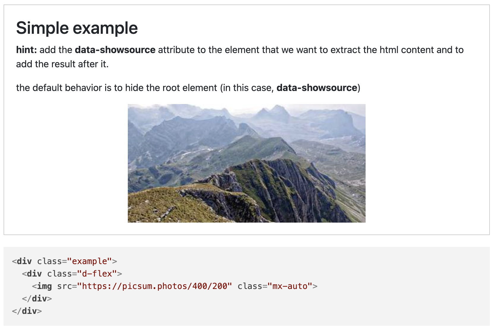

# Extract HTML code from HTML documents (showsource)

This library enables to extract HTML code from the current HTML document, and to add it to the current document in the form of source code.

The library is useful for showing the source code of the current HTML document, and its origin was to ease the creation of web pages for examples of HTML and CSS fragments. My problem was that I wanted to show the example and the code that generated it, but I did not want to maintain two separate code-fragments. This library solves this problem by extracting the HTML code from an element from the current document and adding it to the document in the form of source code.

## Use case

The idea is that if we include the following code in the HTML document:

```html
<div class="example" data-showsource>
    <h2>Simple example</h2>
    <p><span class="fw-bold">hint:</span> add the <span class="fw-bold">data-showsource</span> attribute to the element that we want to extract the html content and to add the result after it.</p>
    <p>the default behavior is to hide the root element (in this case, <span class="fw-bold">data-showsource</span>)</p>
    <div class="d-flex">
        
    </div>
</div>
```

The result will be as shown in the image below: we'll have a block with a title, the texts, and the image. By including the attribute `data-showsource`, in the envelope (i.e. the _example_ `div`), we'll have the source code of the block after it.



Once generated, we can use the library [highlightjs](https://highlightjs.org/) to highlight the source code (but this library does not require it).

## Usage

The library is available in the form of a CDN, so we can include it in our HTML document as follows:

```html
<script src="https://cdn.jsdelivr.net/gh/dealfonso/showsource@1/showsource.min.js"></script>
```

The library will discover any element with the `data-showsource` attribute and will add the source code of the element after it.

### Declarative

The library can be used in a declarative way, by adding the `data-showsource` attribute to the element that we want to extract the HTML content and to add the result after it. A simple example is shown below:

```html
<div class="example" data-showsource>
    <h2>Simple example</h2>
    <div class="d-flex">
        
    </div>
</div>
```

### Javascript API

It is also possible to use the library from Javascript. So, we can use it to extract the HTML code from an element in a beautiful format (i.e. with indentation and line breaks). Then we can use the result to show it in a dialog, or to add it to the document in a different way.

The library will be available in the global variable `showsource` with the following methods:
- `showsource.beautify(el, userOptions = {}, indent = "")` - returns a list of strings with the HTML source code of the element `el` and its children. The `userOptions` parameter is optional and allows to customize the behavior of the function. The `indent` parameter is optional and is used to indent the source code.

- `showsource.init()` - discovers any element with the `data-showsource` attribute and adds the source code of the element after it. The function returns the list of elements that have been processed.

    This method is called automatically when the library is loaded, but it can be called again if we add new elements with the `data-showsource` attribute.

An example of usage is shown below:

```javascript
// get the element that we want to extract the html content
const el = document.querySelector(".example");
let lines = showsource.beautify(el);

// add the source code to the document
el.insertAdjacentHTML("afterend", `<pre><code>${lines.join("\n")}</code></pre>`);
```

### Options

The `showsource.beautify` method accepts an optional `userOptions` parameter that allows to customize the behavior of the function. The following options are available:

```javascript
{
// The indentation to be used (the spaces at the beginning of the line) (inheritable)
indentation: "  ",
// Remove the children of these types of elements
remove: "h1 h2 h3 h4 h5 h6 p",
// Hide the element (i.e. the tag) itself, but not its children
hide: false,
// Skip the element, along with its children
skip: false,
// Skip the children of the element, but not the element itself
skipChildren: false,
// Hide the attributes related to this plugin (inheritable)
hidePlugin: true,
// The attributes to be removed from the element
removeAttributes: null,
// The class attribute to add to the main container div
class: "showsource"
}
```

The options can also be used in the declarative way, by adding the `data-showsource-*` attributes to the element that we want to extract the HTML content and to add the result after it.

The possible options are:
- `data-showsource-indentation` is the indentation to be used (the spaces at the beginning of the line), that will be accumulated when rendering the children. The default value is two spaces, so that the source corresponding to the children of the element will have two extra spaces at the beginning. The value is inheritable to the children.
- `data-showsource-remove` is a space separated list of html elements (or selectors) to be removed from the element. The default value is `h1 h2 h3 h4 h5 h6 p`.
- `data-showsource-hide` instructs the library to hide the render of the current element (i.e. the tag) itself, but not its children. The children will be rendered at the level of the current element. The default value is `false`.
- `data-showsource-skip` instructs the library to skip the element, along with its children. The default value is `false`.
- `data-showsource-skip-children` instruct the library to the children of the element, but not the element itself (unless the `data-showsource-hide` attribute is also present). The default value is `false`.
- `data-showsource-hide-plugin` instructs the library to hide the attributes related to this plugin (i.e. the `data-showsource-*` attributes). The default value is `true`. This attribute is inheritable to the children.
- `data-showsource-remove-attributes` is a space separated list of the attributes to be hidden from the element. The default value is `null`.
- `data-showsource-class` is a space separated list of classes to add to the main container div. The default value is `showsource`.
